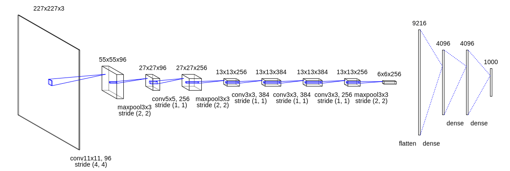
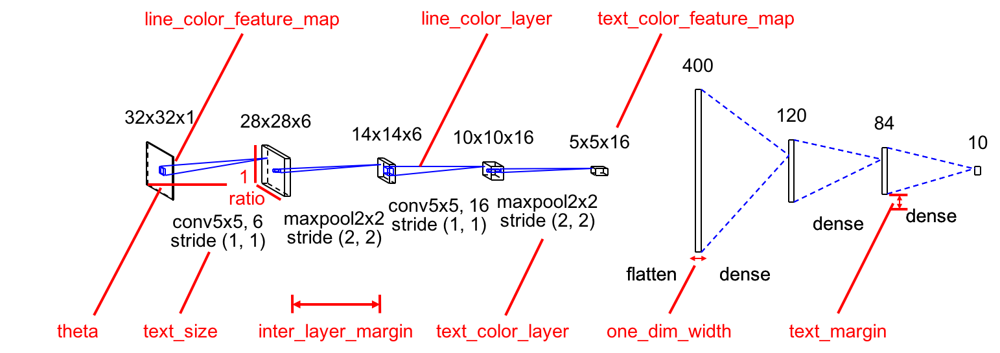
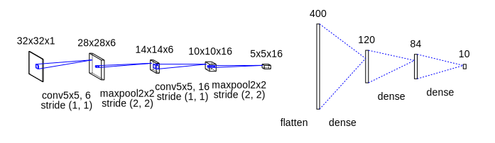
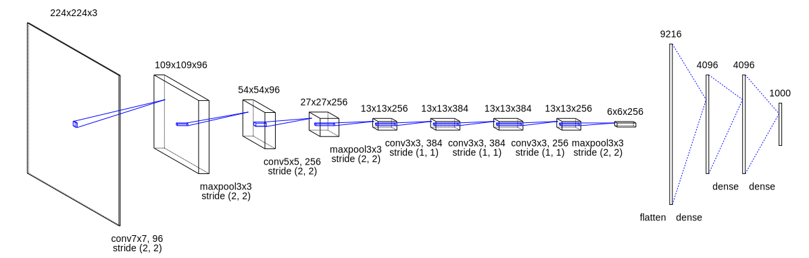
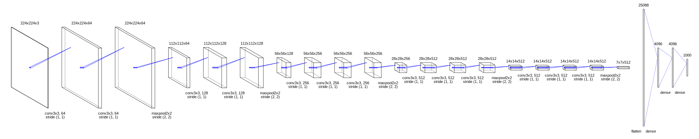
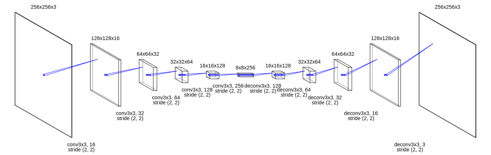
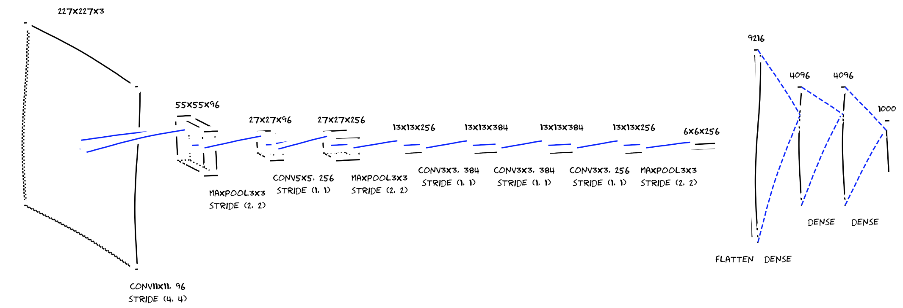

# ConvNet Drawer

Python script for illustrating Convolutional Neural Networks (CNN).
Inspired by the draw_convnet project [1].

Models can be visualized via Keras-like ([Sequential](https://keras.io/models/sequential/)) model definitions.
The result can be saved as SVG file or pptx file!

## Requirements
python-pptx (if you want to save models as pptx)

```sh
pip install python-pptx
```

Keras (if you want to convert Keras sequential model)

```sh
pip install keras
```

matplotlib (if you want to save models via matplotlib)

```bash
pip install matplotlib
```

## Usage
Write a script to define and save a model. An example of visualizing AlexNet [2] is as follows.

### Write and save convnet_drawer.Model

```python
from convnet_drawer import Model, Conv2D, MaxPooling2D, Flatten, Dense
from pptx_util import save_model_to_pptx
from matplotlib_util import save_model_to_file

model = Model(input_shape=(227, 227, 3))
model.add(Conv2D(96, (11, 11), (4, 4)))
model.add(MaxPooling2D((3, 3), strides=(2, 2)))
model.add(Conv2D(256, (5, 5), padding="same"))
model.add(MaxPooling2D((3, 3), strides=(2, 2)))
model.add(Conv2D(384, (3, 3), padding="same"))
model.add(Conv2D(384, (3, 3), padding="same"))
model.add(Conv2D(256, (3, 3), padding="same"))
model.add(MaxPooling2D((3, 3), strides=(2, 2)))
model.add(Flatten())
model.add(Dense(4096))
model.add(Dense(4096))
model.add(Dense(1000))

# save as svg file
model.save_fig("example.svg")

# save as pptx file
save_model_to_pptx(model, "example.pptx")

# save via matplotlib
save_model_to_file(model, "example.pdf")
```

Result:



The other examples can be found [here](examples).

### Convert Keras sequential model
Keras sequential model can be converted to `convnet_drawer.Model` (thanks to @wakamezake).
Only Conv2D, MaxPooling2D, GlobalAveragePooling2D, Flatten, Dense layers are supported for this conversion.

```python
from keras_util import convert_drawer_model
from keras_models import AlexNet
from pptx_util import save_model_to_pptx
from matplotlib_util import save_model_to_file

# get Keras sequential model
keras_sequential_model = AlexNet.get_model()
model = convert_drawer_model(keras_sequential_model)

# save as svg file
model.save_fig("example.svg")

# save as pptx file
save_model_to_pptx(model, "example.pptx")

# save via matplotlib
save_model_to_file(model, "example.pdf")
```

### Supported Layers

- *Conv2D*
  - ```Conv2D(filters=None, kernel_size=None, strides=(1, 1), padding="valid")```
  - e.g. `Conv2D(96, (11, 11), (4, 4)))`
- *Deconv2D*
  - ```Deconv2D(filters=None, kernel_size=None, strides=(1, 1), padding="valid")```
  - e.g. `Deconv2D(256, (3, 3), (2, 2)))`
- *MaxPooling2D*, *AveragePooling2D*
  - ```MaxPooling2D(pool_size=(2, 2), strides=None, padding="valid")```
  - e.g. `MaxPooling2D((3, 3), strides=(2, 2))`
  - If `strides = None`, stride is set to be `pool_size`.
- *GlobalAveragePooling2D*
  - ```GlobalAveragePooling2D()```
- *Flatten*
  - ```Flatten()```
- *Dense*
  - ```Dense(units)```
  - e.g. `Dense(4096)`

### Visualization Parameters
Visualization Parameters can be found in [config.py](config.py).
Please adjust these parameters before model definition (see [LeNet.py](examples/LeNet.py)).
The most important parameter is `channel_scale = 3 / 5`.
This parameter rescale actual channel size `c` to `c_` for visualization as:

```c_ = math.pow(c, channel_scale)```

If the maximum channel size is small (e.g. 512), please increase `channel_scale`.

Check how the other parameters works:



#### Default Values

```python
theta = - math.pi / 6
ratio = 0.7
bounding_box_margin = 10
inter_layer_margin = 50
text_margin = 10
channel_scale = 3 / 5
text_size = 14
one_dim_width = 4
line_color_feature_map = (0, 0, 0)
line_color_layer = (0, 0, 255)
text_color_feature_map = (0, 0, 0)
text_color_layer = (0, 0, 0)
```


## TODOs
- [x] Implement padding option for Conv2D and Pooling layers.
- [x] Add some effects to Dense layer (and Flatten / GlobalAveragePooling2D).
- [ ] Automatically calibrate the scale of feature maps for better visibility.
- [x] Move hard-coded parameters to a config file or options.
- [x] Refactor Layer classes.
- [x] ~~Draw with matplotlib? for other formats.~~ The model is now directly saved as a pptx file.

## Results
LeNet



AlexNet


ZFNet



VGG16



AutoEncoder



AlexNet saved by matplotlib with plt.xkcd()



## References
[1] https://github.com/gwding/draw_convnet

[2] A. Krizhevsky, I. Sutskever, and G. E. Hinton, "ImageNet Classification with Deep Convolutional Neural Networks," in Proc. of NIPS, 2012.